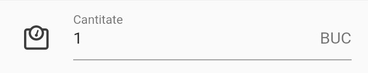

Ezen a képernyőn láthatjuk a beszkennelt tételek sorait, a serial-osokat és a nem serial-osokat, de közülük csak a nem serial-osok szerkeszthetők itt. A képernyő tetején egy összesítő látható, ahol a narancssárga számok közül az első az aktuális stoc-sorról jelenleg livrált mennyiséget jelenti, míg a zárójelben lévő szám azt mutatja meg, hogy a kurrens stoc-soron mekkora mennyiség van még. A következő számcsoport első tagja megmutatja, mekkora mennyiséget kér a forrásdokumentum pozíciója, míg a második tagja az eddig összesen kivezetett mennyiséget. (Ha zöld, akkor a kért mennyiség teljesen ki van vezetve, ha piros, akkor még nincs kivezetve minden)

A **Cantitate** mező segítségével az aktuális pozícióhoz hozzáadhatunk (vagy más rendszerek esetében felülírhatjuk) egy tetszőleges mennyiséget, figyelve arra, hogy az összmennyiség ne haladja meg a forrásdokumentumban szereplő számot, illetve, hogy elegendő mennyiség legyen az aktuális stoc-soron.

**Mentés** gombbal a Cantitate mezőben látható mennyiség összeadódik a narancssárga színnel szereplő mennyiséggel. (Kizárólag Autoid esetében, ugyanis máshol a Cantitate mezőben szereplő mennyiség felülírja a narancssárga színnel jelölt mennyiséget).