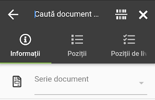

Az alkalmazásban kétféleképpen indíthatunk Livrare-t: közvetlenül a forrásdokumentumokról vagy valamely forrásdokumentum vonalkódjának beszkennelésével. Két forrásdokumentum és három céldokumentum létezik. 

# Forrásdokumentumok

*   Comanda (Megrendelő)
*   Factura (Számla)

# Céldokumentumok

*   Aviz (Szállítólevél)
*   Factura (Számla)
*   Nota de livrare 

# Livrare indítása forrásdokumentumról

**Vanzari / Comenzi** vagy **Vanzari / Facturi** alatt megnyitunk egy lezárt dokumentumot, majd a képernyő bal alsó sarkában található Menü ikon megnyomása után kiválasztjuk a Livrare-t.

# Livrare indítása vonalkódról

A forrásdokumentum vonalkódját a **Managementul depozitului / Livrare** alatt lehet beszkennelni a plusz ikon megnyomását követően.

**Fontos:**  

1. Csak lezárt forrásdokumentumról lehet Livrare-t indítani 

2. Amennyiben Factura-ról indítunk, kizárólag Nota de livrare lehet a céldokumentum, ha pedig Comanda-ról, akkor Aviz, Factura vagy Nota de livrare; 

3. Ha van Comanda és nincs Factura, a forrásdokumentum a Comanda;
4. Ha létezik Comanda és Factura is, de ez utóbbi nincs mentesítve, a forrásdokumentum kizárólag a Factura lehet; 

5. Ha pedig mindkét forrásdokumentum létezik, és a számla mentesítve volt, nem lehet egyikről sem Livrare-t indítani.
