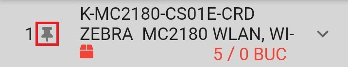

# Serial-os termékek

*   Ha serial-os terméket szkennelünk, és létezik a beazonosított sor a rendszerben (stock-sor + mennyiség), akkor 1 egységnyi mennyiséggel új pozíció sor jön létre.
*   Ha a beszkennelt vonalkód alapján nincs találat vagy sikertelen a kivezető sor létrehozása, akkor hibaüzenetet kapunk

# Nem serial-os termékek

*   Ha nem serial-os terméket szkennelünk, és létezik a beazonosított sor a rendszerben, valamint a beazonosított sorról nincs még livrálva, akkor a termék 1 egységnyi mennyiséggel automatikusan felkerül (Kizárólag Autoid esetében, ugyanis más rendszerekben egy szerkesztő képernyőt kapunk, ahol megadhatjuk a kurrens stoc-sorrol mentesítendő mennyiséget).
*   Ha létezik a beazonosított sor a rendszerben, és a beazonosított sorról már volt livrálva, akkor felugró üzenetet kapunk → meg kell keresni a szóban forgó sort, és manuálisan szerkeszteni, vagy a Detalii tabon újra kell szkennelni a vonalkódot, és az így beazonosított sort szerkeszteni)
*   Ha létezik a beazonosított sor a rendszerben, de már nem létezik raktáron, akkor erről hibaüzenetben tájékoztat az alkalmazás.
*   Ha a beszkennelt termékből nincs elegendő mennyiség az aktuális soron, újat kell szkennelni.

# Pozíció rögzítése (Pin)
Livráláskor lehetőség van arra, hogy a pozíciók valamelyikét (egyszerre egyet) rögzítsük a képernyőn. Ennek az a gyakorlati haszna, hogy amíg rögzítve van a pozíció, addig kizárólag azt a terméket lehet szkennelni, semmi egyéb nem kerülhet fel a dokumentumra

# Dokumentum lezárása, érvénytelenítése
Dokumentumot (Livrare) lezárni vagy érvényteleníteni az **Informații** tabon lehet a megfelelő státus kiválasztásával és a **Mentés** gomb megnyomásával. 

*   Emis → lezárás
*   Anulat → érvénytelenítés

